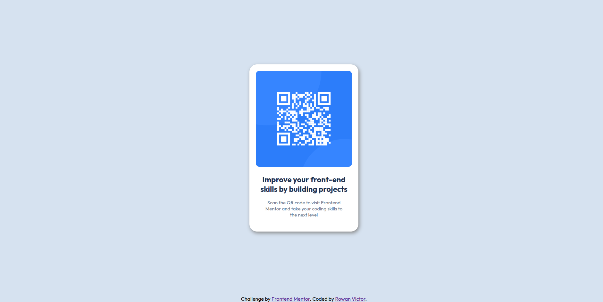

# Frontend Mentor - QR code component solution

This is a solution to the [QR code component challenge on Frontend Mentor](https://www.frontendmentor.io/challenges/qr-code-component-iux_sIO_H). Frontend Mentor challenges help you improve your coding skills by building realistic projects. 

---

## Table of contents

- [Overview](#overview)
  - [Screenshot](#screenshot)
  - [Links](#links)
- [My process](#my-process)
  - [Built with](#built-with)
  - [What I learned](#what-i-learned)
  - [Continued development](#continued-development)
- [Author](#author)

---

## Overview

This project is a solution to the **QR Code Component challenge on Frontend Mentor**. The goal of the challenge was to build a simple and visually accurate card layout that displays a QR code and some accompanying text.

It helped me practice writing semantic HTML and CSS, use Google Fonts, apply box shadows, and center elements using Flexbox. It was also my first time trying to follow a design closely to match spacing, colors, and typography.

### Screenshot

### Links

- Solution URL: [Solutions in Frontend Mentor](https://www.frontendmentor.io/solutions/qr-code-component-page-using-css-PiNIy7aJfD)  
- Live Site URL: [Live Demo using GitHub Pages](https://rowanvictor01.github.io/qr-code-component/)

---

## My process

I started by carefully examining the design preview provided in the challenge files. My goal was to replicate the layout and styling as closely as possible, especially the spacing, colors, and font styles.

I added a few elements to the provided HTML structure like `main`, `article`, and `figure` elements to to group related content together and to use semantic tags to ensure accessibility and clean markup. Then, I linked the Outfit font from Google Fonts in the `<head>` of the document.

For styling, I focused on:  
- Creating a clean card layout  
- Applying Flexbox to center the card vertically and horizontally on the page  
- Using `box-shadow` and `border-radius` to match the card design  
- Ensuring the layout looks consistent on small and large screen sizes  

### Built with

- Semantic HTML5 markup  
- CSS  
- Flexbox  

### What I learned

This was my first time following a provided design and trying to match it as closely as possible. I learned how to import and use fonts from Google Fonts, practiced using Flexbox for centering and layout, and applied `box-shadow` for styling the card. This helped me get more comfortable with translating a visual design into code.

### Continued development

In future projects, I want to improve my overall CSS skills, especially in terms of layout techniques and writing cleaner, more maintainable styles.

---

## Author

- Dev.to - [@rowanvictor01](https://dev.to/rowanvictor01)
- Frontend Mentor - [@rowanvictor01](https://www.frontendmentor.io/profile/rowanvictor01)
- Twitter - [@rowanlearnscode](https://x.com/rowanlearnscode)
- GitHub - [rowanvictor01](https://github.com/rowanvictor01)
